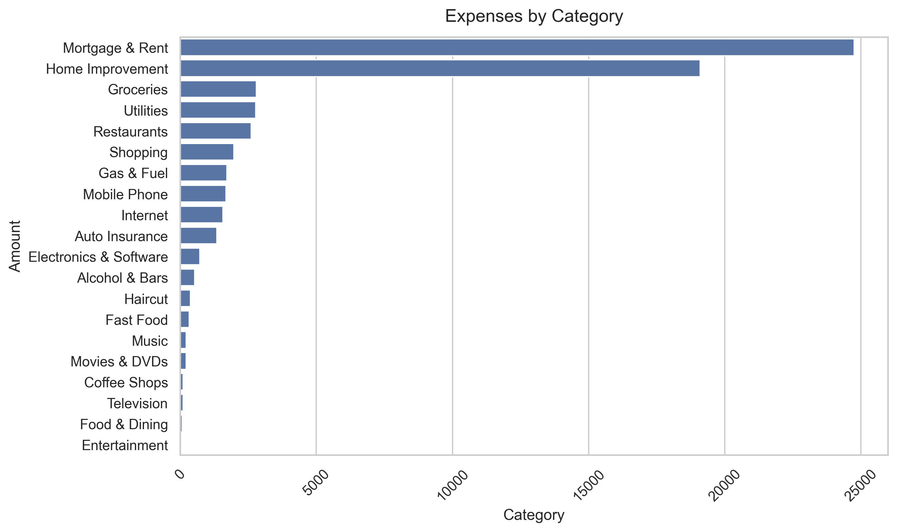

# 📊 Personal Finance Analysis

## 🔍 Overview

This project analyzes personal financial transactions to understand spending patterns, income behavior, and overall financial habits.

The analysis focuses on identifying key expense categories, evaluating financial structure, and generating actionable insights from transaction data.

---

## 📁 Dataset

The dataset was obtained from Kaggle and contains individual financial transactions, including:

* Date
* Description
* Amount
* Transaction Type (credit/debit)
* Category
* Account Name

---

## 🎯 Objective

The goal of this project is to:

* Identify major expense drivers
* Understand how spending is distributed across categories
* Explore financial behavior patterns
* Support data-driven financial decision-making

---

## ⚙️ Methodology

The analysis follows a structured workflow:

* Data loading and initial inspection
* Data cleaning and type conversion
* Transaction classification:

  * Income
  * Expense
  * Transfer
* Feature engineering (time-based variables)
* Aggregation and analysis by category
* Data visualization

---

## 📊 Key Insights

* Housing costs (Mortgage & Rent) represent the largest share of expenses, indicating a high fixed cost structure.

* Home Improvement stands out as the second largest category, suggesting a possible period of elevated spending (e.g., renovations). Further time-based analysis is required to determine whether this is seasonal or sporadic.

* Essential living expenses such as Groceries, Utilities, and Restaurants show similar spending levels, indicating a relatively stable consumption pattern.

* A long tail of smaller expense categories is present, which individually have low impact but may represent a meaningful share when combined.

---

## 📊 Visualization

### Expenses by Category

---

## 🛠️ Tools

* Python
* Pandas
* Seaborn
* Matplotlib

---

## 🚀 Next Steps

Future improvements for this analysis include:

* Time-based analysis (monthly trends)
* Savings rate calculation
* Seasonality detection
* Budget vs actual comparison

---
